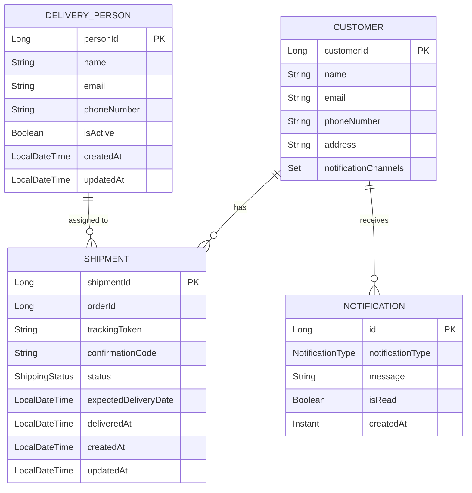
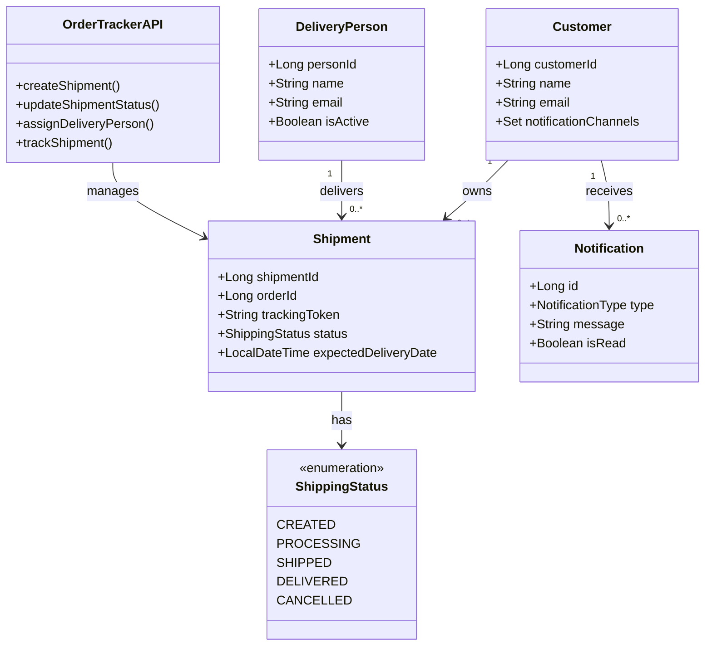

# OrderTracker
A Spring Boot-based Order Notification System managing order lifecycle (Created, Paid, Processed, Shipped, Delivered, Completed) with real-time customer notifications. Includes inventory management for stock tracking and updates.


## System Architecture

### ER Diagram



### UML Class Diagram



## Comprehensive API Endpoint Documentation

### Shipment Endpoints

#### Create Shipment
- **Endpoint**: `POST /shipments`
- **Description**: Create a new shipment record
- **Request Body**:
  ```json
  {
    "orderId": "string",
    "customerId": "string",
    "expectedDeliveryDate": "datetime"
  }
  ```
- **Responses**: 
  - `201 Created`: Shipment successfully created
  - `400 Bad Request`: Invalid input

#### Get Shipment Details
- **Endpoint**: `GET /shipments/{shipmentId}`
- **Description**: Retrieve detailed information about a specific shipment
- **Path Parameters**:
  - `shipmentId`: Unique identifier of the shipment
- **Responses**:
  - `200 OK`: Shipment details returned
  - `404 Not Found`: Shipment not found

#### Track Shipment
- **Endpoint**: `GET /shipments/track/{trackingToken}`
- **Description**: Track shipment status using tracking token
- **Path Parameters**:
  - `trackingToken`: Unique tracking identifier
- **Responses**:
  - `200 OK`: Current shipment status
  - `404 Not Found`: Invalid tracking token

#### Update Shipment Status
- **Endpoint**: `PATCH /shipments/{shipmentId}/status`
- **Description**: Update the current status of a shipment
- **Request Body**:
  ```json
  {
    "status": "SHIPPED|DELIVERED|CANCELLED"
  }
  ```
- **Responses**:
  - `200 OK`: Status successfully updated
  - `400 Bad Request`: Invalid status transition

### Delivery Person Endpoints

#### Get Available Delivery Persons
- **Endpoint**: `GET /delivery-persons/available`
- **Description**: Retrieve list of currently available delivery personnel
- **Responses**:
  - `200 OK`: List of available delivery persons
  - `204 No Content`: No available delivery persons

#### Assign Delivery Person
- **Endpoint**: `POST /shipments/{shipmentId}/assign`
- **Description**: Assign a delivery person to a specific shipment
- **Request Body**:
  ```json
  {
    "deliveryPersonId": "string"
  }
  ```
- **Responses**:
  - `200 OK`: Delivery person successfully assigned
  - `404 Not Found`: Shipment or delivery person not found

### Notification Endpoints

#### Get Customer Notifications
- **Endpoint**: `GET /customers/{customerId}/notifications`
- **Description**: Retrieve notifications for a specific customer
- **Responses**:
  - `200 OK`: List of customer notifications
  - `404 Not Found`: Customer not found

#### Mark Notification as Read
- **Endpoint**: `PATCH /notifications/{notificationId}`
- **Description**: Update notification read status
- **Request Body**:
  ```json
  {
    "isRead": true
  }
  ```
- **Responses**:
  - `200 OK`: Notification status updated
  - `404 Not Found`: Notification not found
